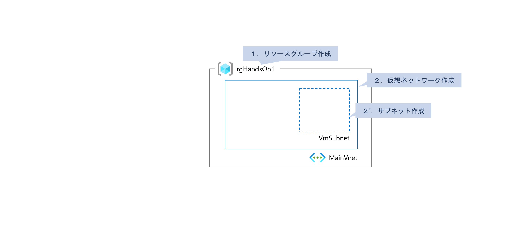
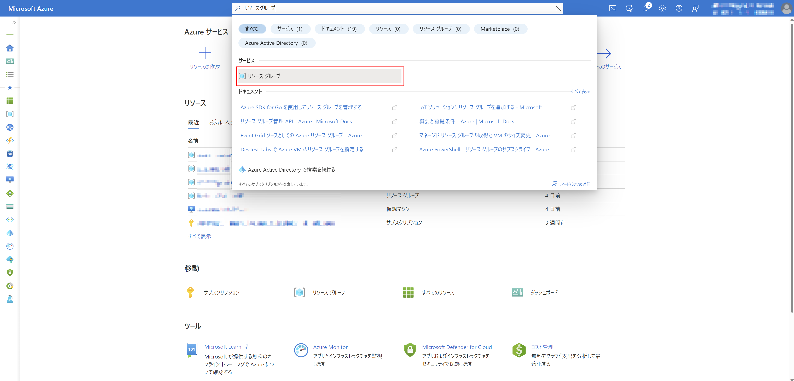
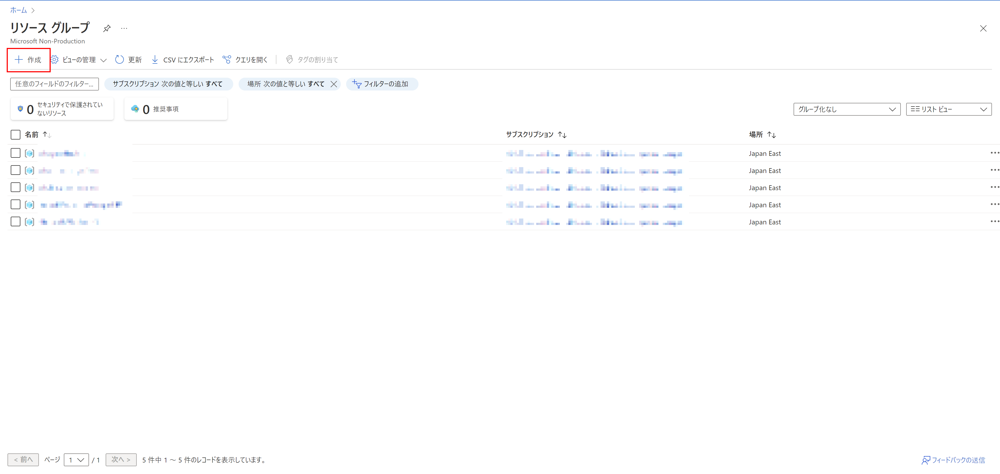
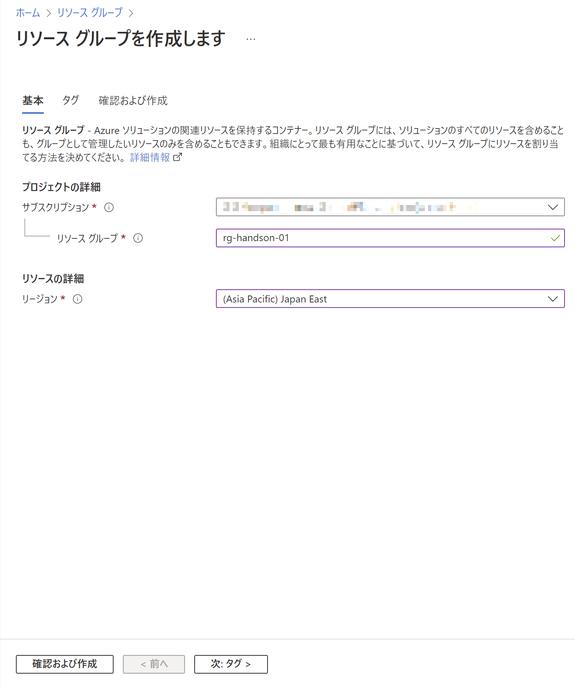
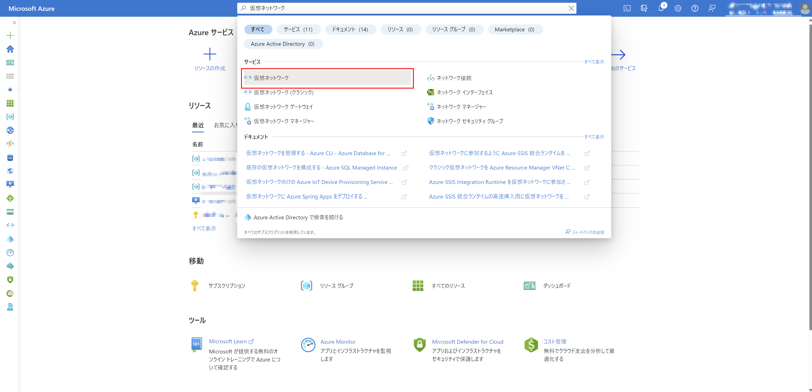
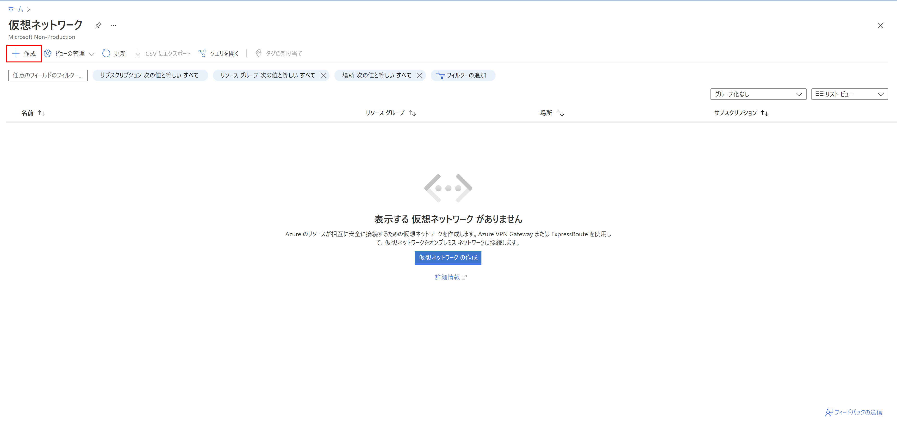
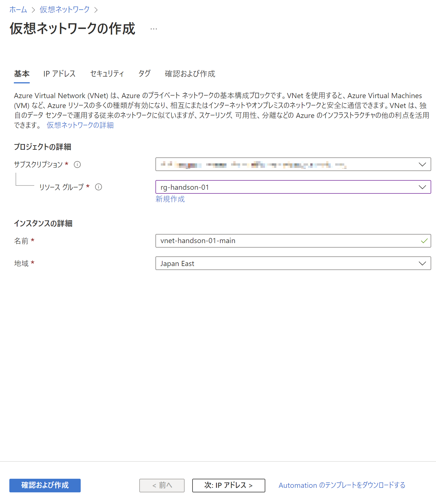

# Exercise1: ネットワーク作成

## 【目次】

1. [リソースグループ作成](#リソースグループ作成)
1. [仮想ネットワーク, サブネット作成](#仮想ネットワーク-サブネット作成)

## リソースグループ作成

1. Azureポータル上部の検索窓から「リソースグループ」を検索

    

1. 「作成」を選択

    

1. リソースグループを作成

    1. 基本

        * サブスクリプション：（ハンズオン用に用意されたもの）
        * リソースグループ：（任意名）
        * リージョン： `Japan East`

        

    1. タグ

        特に指定はせず次へ

    1. 確認および作成

        内容確認して「作成」

## 仮想ネットワーク, サブネット作成

1. Azureポータル上部の検索窓で「仮想ネットワーク」を検索して選択

    

1. 「作成」を選択

    

1. 仮想ネットワークを作成

    1. 「基本」ページで以下を設定して次へ

        * サブスクリプション：（ハンズオンで利用予定のもの）
        * リソースグループ：（作成済みのもの）
        * 名前：（任意。仮想ネットワークの名前）
        * 地域： `Japan East`

        

    1. 「IPアドレス」ページで以下を設定して次へ

        * IPv4アドレス空間：（任意。プライベートIPアドレス空間推奨）
        * サブネット：（任意。仮想マシン用のサブネットを定義）
  
        

      
    1. セキュリティ

        特に指定なし

    1. タグ

        特に指定なし
    
    1. 確認および作成

        内容を確認して「作成」

# 次の Exercise へ

* [ネットワークセキュリティグループ作成](exercise02.md)
