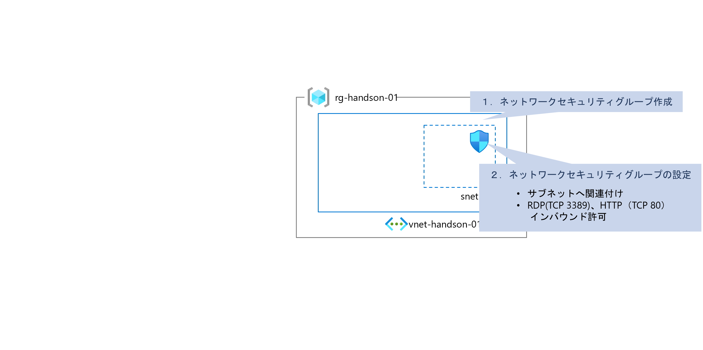
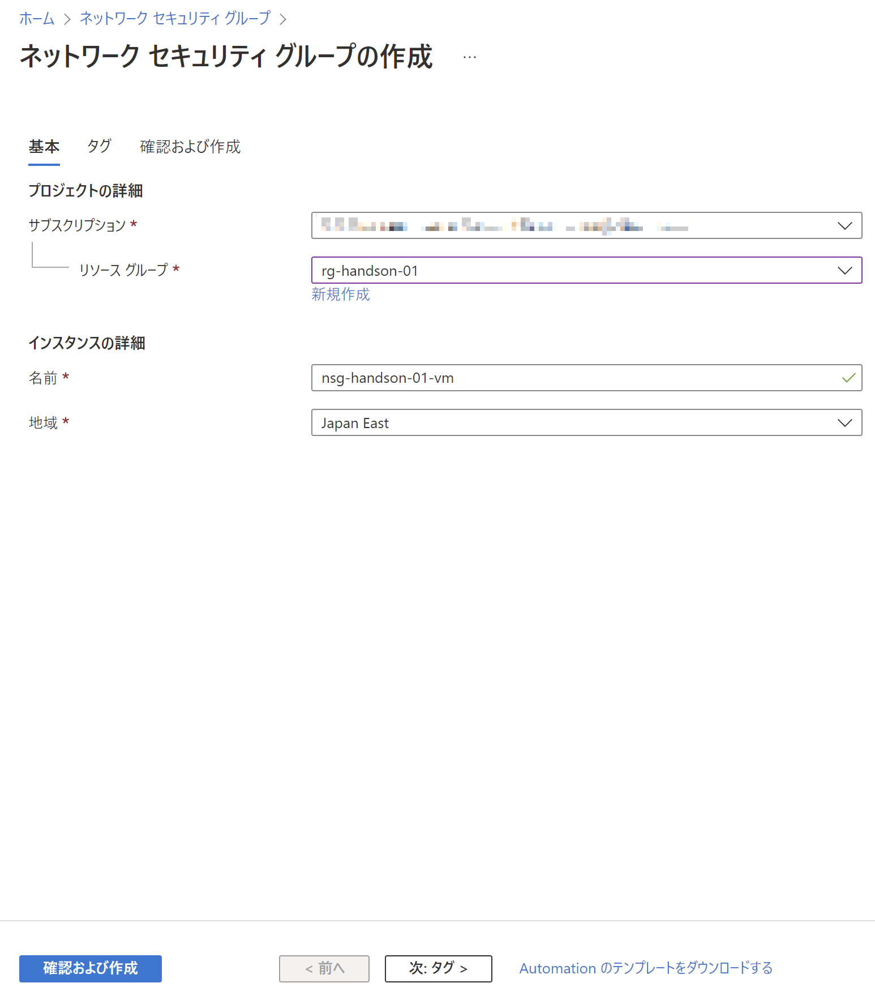
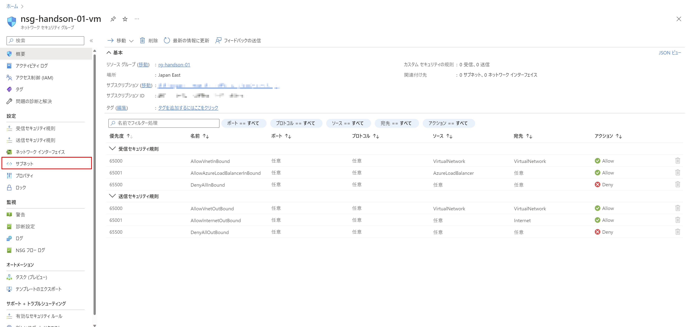
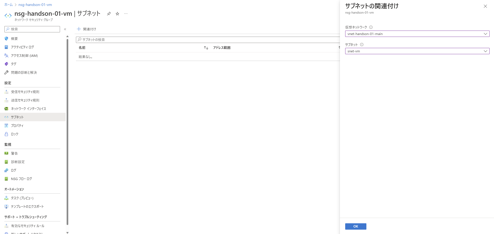
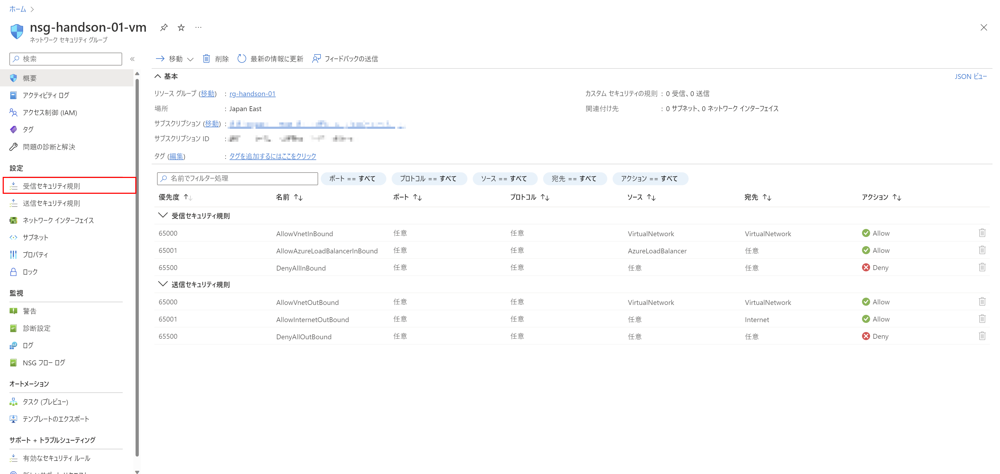
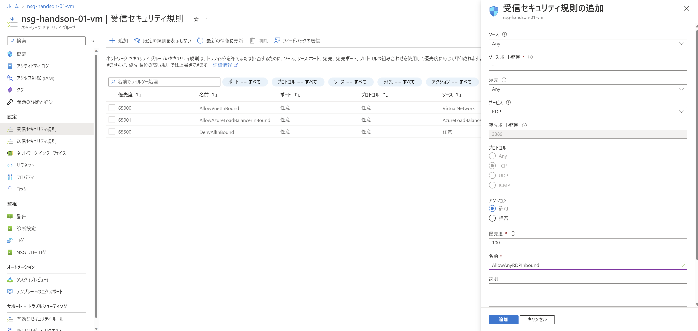

# Exercise2: ネットワークセキュリティグループ作成

## 【目次】

1. [ネットワークセキュリティグループ作成](#ネットワークセキュリティグループ作成)
1. [ネットワークセキュリティグループの設定](#ネットワークセキュリティグループの設定)

## ネットワークセキュリティグループ作成

1. Azureポータル上部の検索窓で「ネットワークセキュリティグループ」を検索、開く

1. 「ネットワークセキュリティグループ」一覧画面上の「作成」を選択

1. ネットワークセキュリティグループの作成

    1. 「基本」ページ

        * サブスクリプション：（ハンズオン用に用意されたもの）
        * リソースグループ：（作成済みのもの）
        * 名前：（任意）
        * 地域： `Japan East`

        
    
    1. 「タグ」ページ

        特に指定なし
    
    1. 「確認および作成」ページ

        内容を確認して「作成」

## ネットワークセキュリティグループの設定

作成完了画面の「リソースに移動」または「ネットワークセキュリティグループの一覧画面」から作成したネットワークセキュリティグループへ移動

1. サブネットへの関連付け

    1. [設定]-[サブネット]を開く

        

    1. 「関連付け」を選択して以下を設定、「OK」を選択

        * 仮想ネットワーク：（作成済みの仮想ネットワーク）
        * サブネット：（仮想マシン用のサブネット）
    
        

    1. [設定]-[受信セキュリティ規則]を開く

        

    1. 「追加」を選択して「受信セキュリティ規則」に「RDP」の受信規則を追加

        * ソース： `Any`
        * ソースポート範囲： `*`
        * 宛先： `Any`
        * サービス： `RDP`
        * アクション： `許可`
        * 優先度：（任意。100~。）
        * 名前：（任意）

        

    1. 同様に「HTTP」の受信規則を追加

        * ソース： `Any`
        * ソースポート範囲： `*`
        * 宛先： `Any`
        * サービス： `HTTP`
        * アクション： `許可`
        * 優先度：（任意。100~。ただしRDPの番号と被らない値）
        * 名前：（任意）

