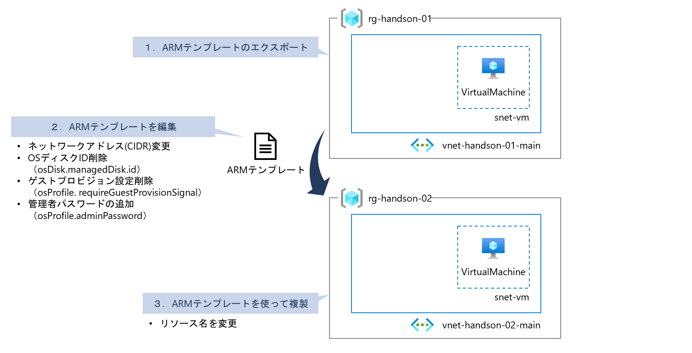
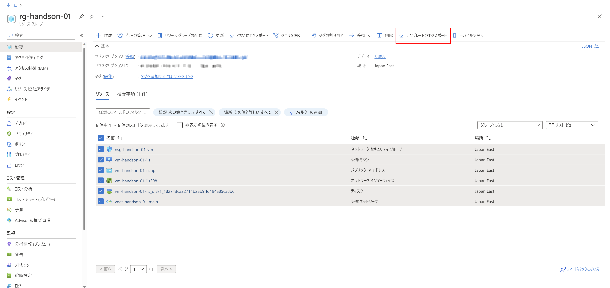
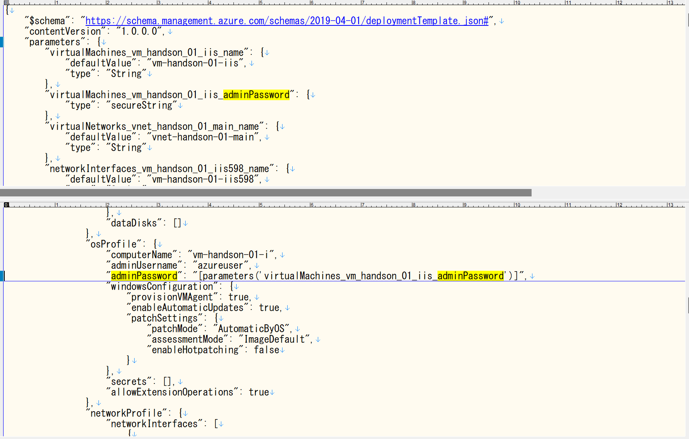
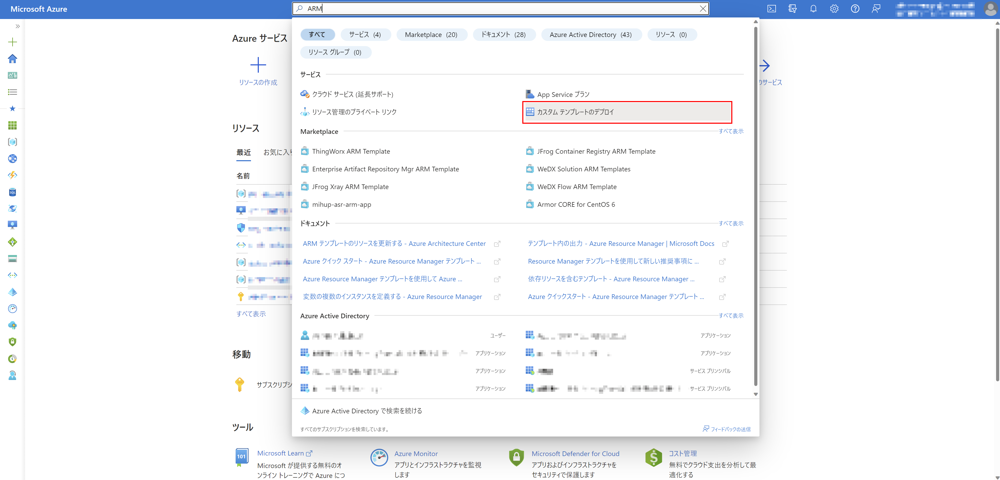
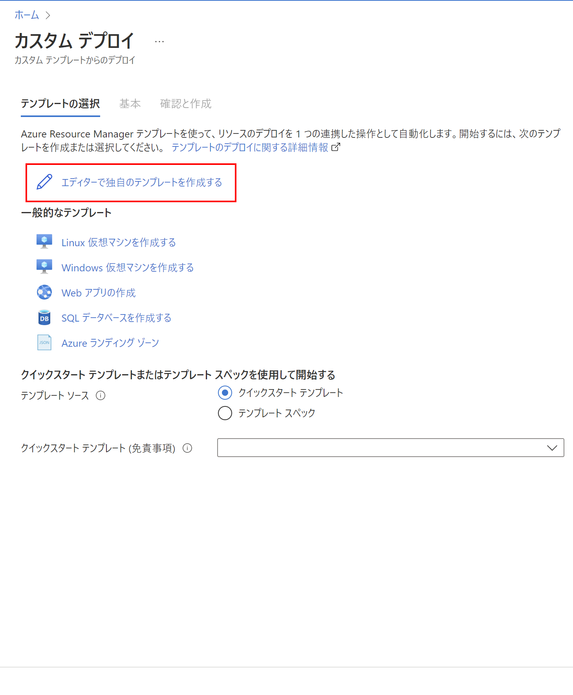
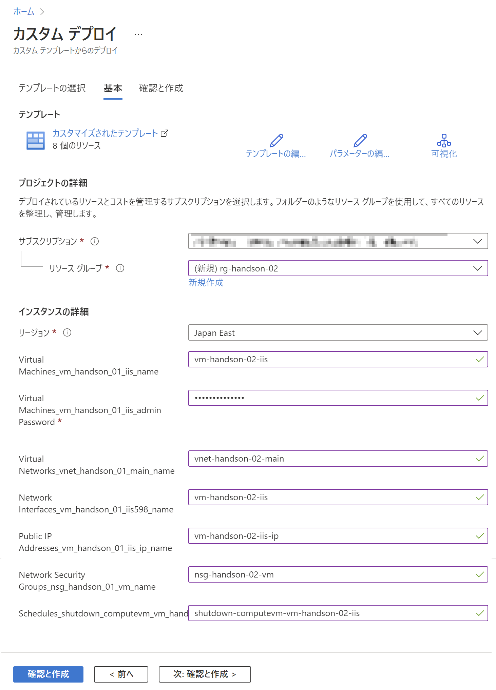

# Exercise4: ARMテンプレート利用

## 【目次】

1. [ARMテンプレートのエクスポート](#armテンプレートのエクスポート)
1. [ARMテンプレートを編集](#armテンプレートを編集)
1. [ARMテンプレートを使って複製](#armテンプレートを使って複製)

## ARMテンプレートのエクスポート

1. Azureポータル上部の検索窓で「リソースグループ」を検索、開く

1. 一覧から作成したリソースグループを開く

1. 「概要」に表示されるリソースすべてにチェックを入れて「テンプレートのエクスポート」を選択

    

1. 「ダウンロード」を選択して ARMテンプレート をダウンロード

1. ダウンロードした zip ファイルは展開しておく

    以下、2ファイルが含まれる。
    利用するのは `template.json` のみ。

        <ROOT>
        ├ parameters.json
        └ template.json

## ARMテンプレートを編集

1. `template.json` に対して以下を修正

    * ネットワークアドレス(CIDR)変更

        例） `10.0.` → `10.1.` 

        * `properties.addressSpace.addressPrefixes`
        * `properties.subnets.properties.addressPrefix`
        * `properties.ipConfigurations.properties.privateIPAddress`
        * `properties.addressPrefix`

    * OSディスクID削除 （ `osDisk.managedDisk.id` ）
    * ゲストプロビジョン設定削除 （ `osProfile.requireGuestProvisionSignal` ）
    * 管理者パスワードの追加 （ `osProfile.adminPassword` ）

        

## ARMテンプレートを使って複製

1. Azureポータル上部の検索窓で「ARM」を検索、「カスタムテンプレートのデプロイ」を選択

    

1. カスタムテンプレートのデプロイ

    1. 「テンプレートの選択」ページ

        「エディターで独自のテンプレートを作成する」を選択、
        前のセクションで修正した ARMテンプレート （ `template.json` ） をコピー＆ペースト で貼り付けて「保存」

        

    1. 「基本」ページ

        * リソースグループ：（新規作成）
        * 各種設定：（任意で修正）

        

    1. 「確認と作成」ページ

        内容を確認して「作成」

# 次の Exercise へ

* [VNet Peering 作成](exercise05.md)
