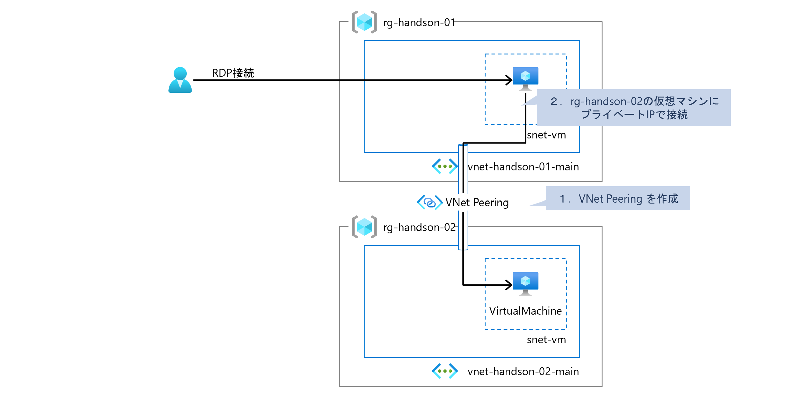
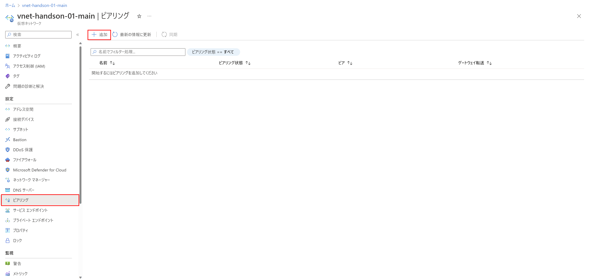
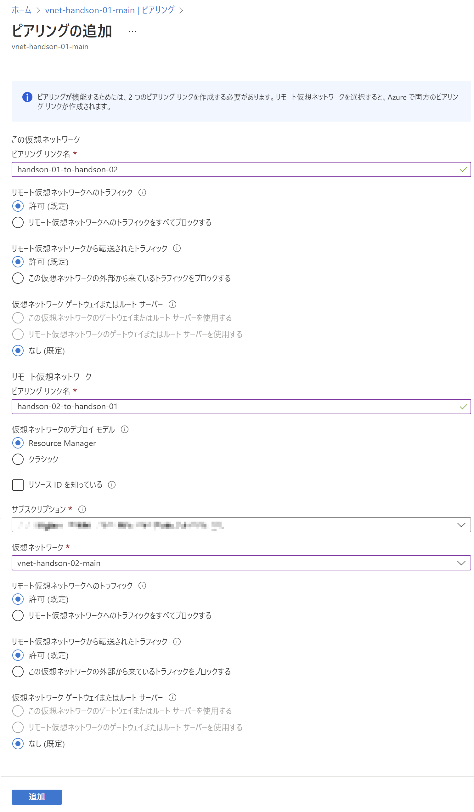
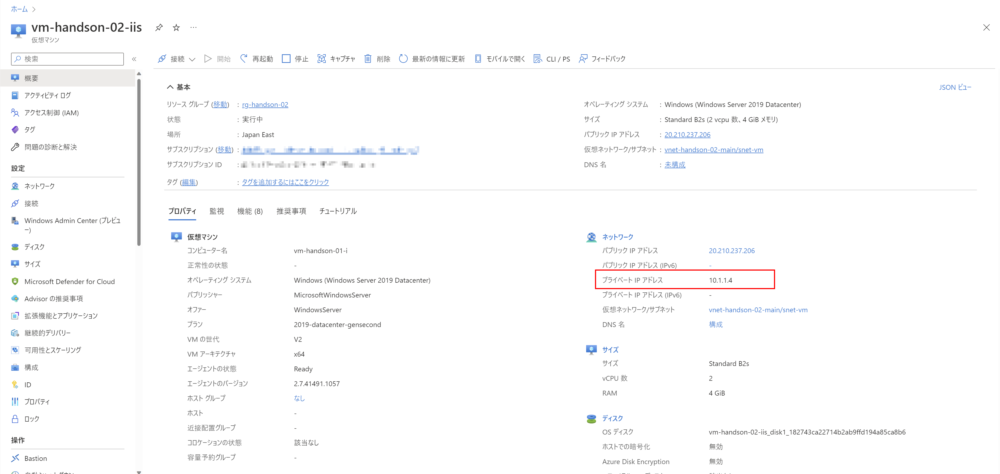
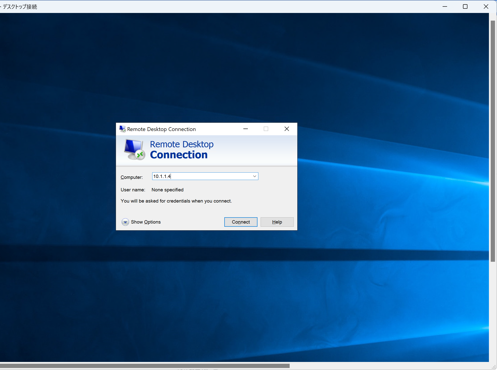
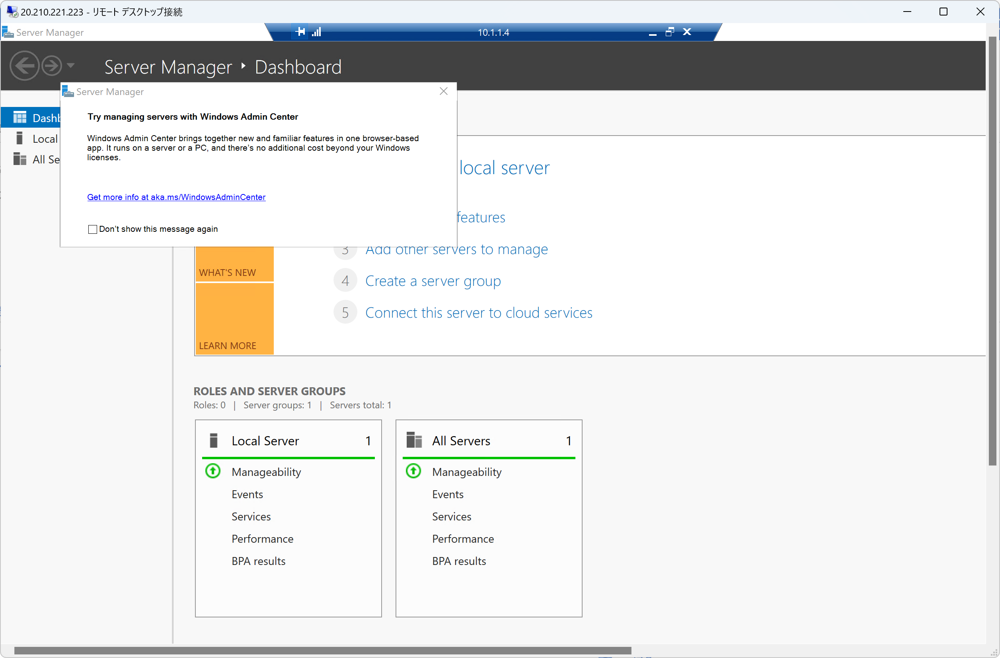

# Exercise5: VNet Peering 作成

## 【目次】

1. [VNet Peering を作成](#vnet-peering-を作成)
1. [プライベートIPでアクセス](#プライベートipでアクセス)

## VNet Peering を作成

1. Azureポータル上部の検索窓で「仮想ネットワーク」を検索、開く

1. 作成済み仮想ネットワークのうち最初に作成した仮想ネットワークを開く

1. [設定]-[ピアリング] を開き、「追加」を選択

    

1. ピアリングの追加

    * この仮想ネットワーク
        * ピアリングリンク名：（任意。handon-01 環境から handson-02 へ向かうピアリングの名称）
    * リモート仮想ネットワーク
        * ピアリングリンク名：（任意。handon-02 環境から handson-01 へ向かうピアリングの名称）
        * サブスクリプション：（本ハンズオンで利用するもの）
        * 仮想ネットワーク： （ARMテンプレートを使って複製した仮想ネットワーク）

    

## プライベートIPでアクセス

1. ARMテンプレートを使って展開した仮想マシンの プライベートIPアドレス を確認

    1. ARMテンプレートを使って複製した仮想マシンを開く

    1. 「概要」に表示される 「プライベートIPアドレス」 を確認

        

1. 最初に作成した仮想マシンへRDP接続

1. 「最初に作成した仮想マシン」から「ARMテンプレートを使って複製した仮想マシン」へ プライベートIPアドレス でRDP接続

    

    接続確認できた状態

    

# 次の Exercise へ

* [ネットワーク作成](exercise06.md)
