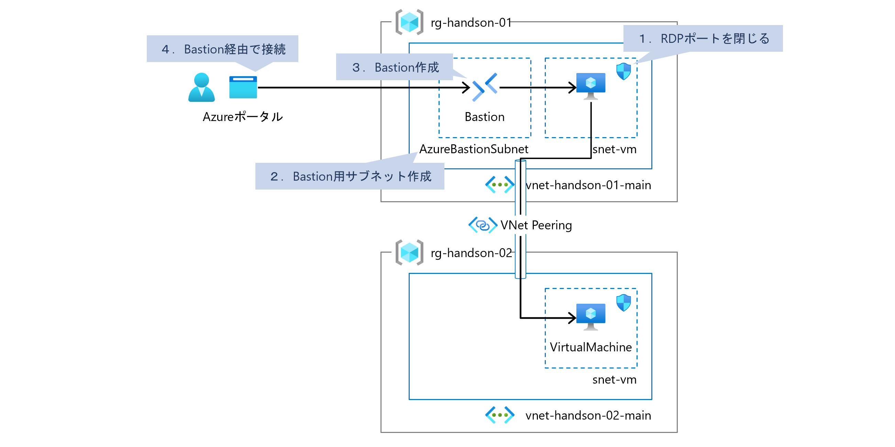
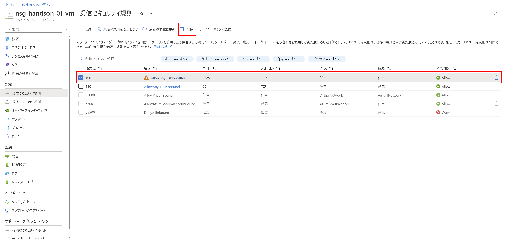
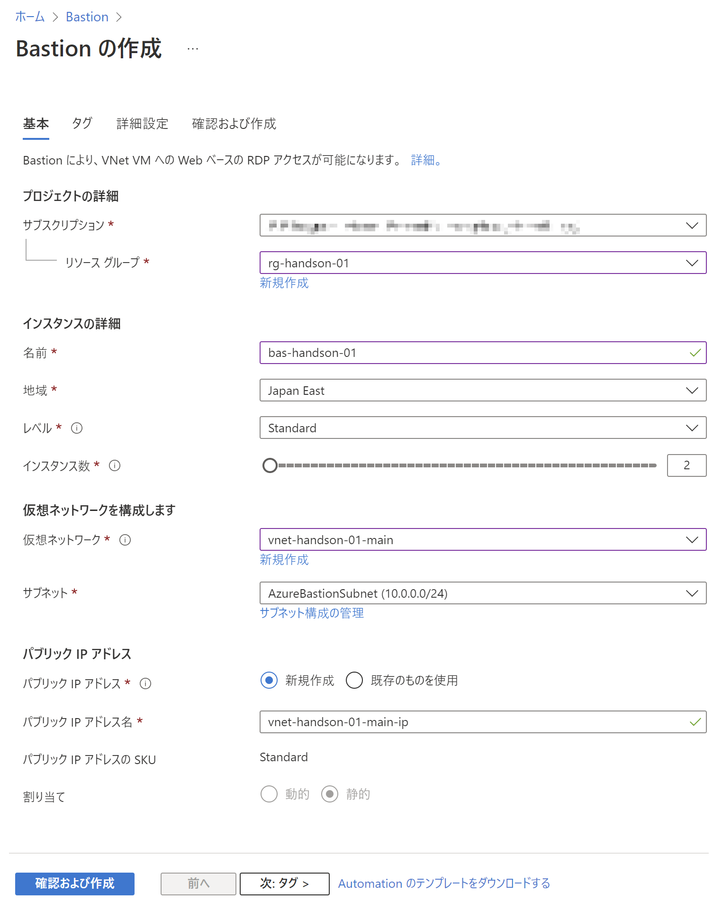
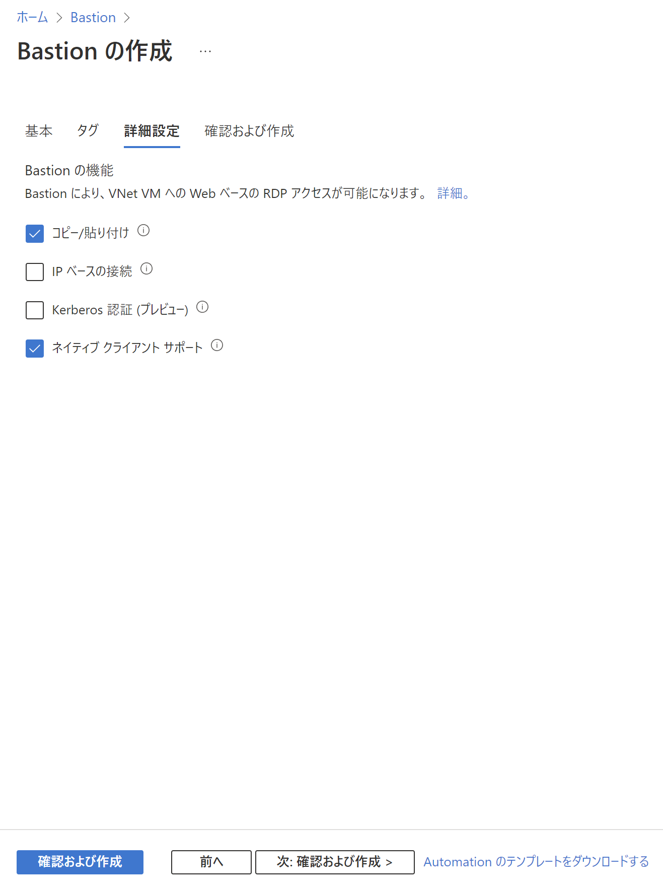
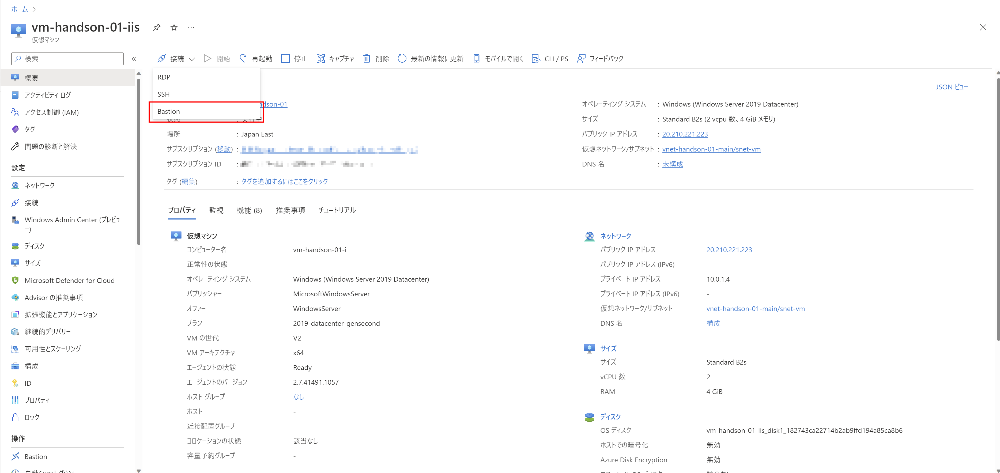
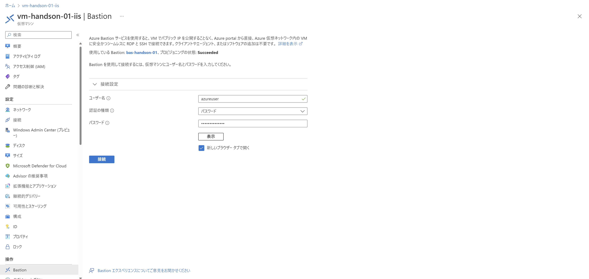
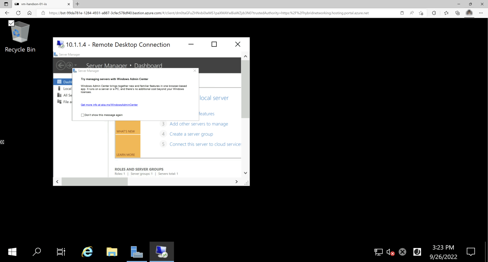
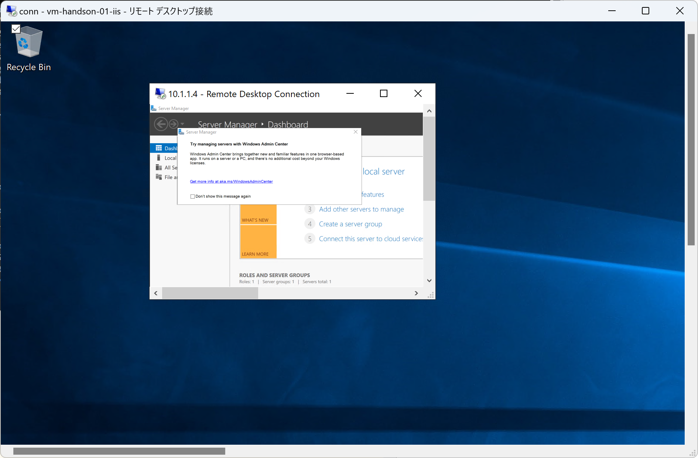

# Exercise6: Bastion利用

## 【目次】

1. [RDPポートを閉じる](#rdpポートを閉じる)
1. [Bastion用サブネット作成](#bastion用サブネット作成)
1. [Bastion作成](#bastion作成)
1. [Bastion経由で接続（Azureポータル）](#bastion経由で接続azureポータル)
1. [Bastion経由で接続（ネイティブクライアント）](#bastion経由で接続ネイティブクライアント)

## RDPポートを閉じる

1. Azureポータル上部の検索窓で「ネットワークセキュリティグループ」を検索、開く

1. 最初に作成したネットワークセキュリティグループを開く

1. [設定]-[受信セキュリティ規則]を開く

1. 解放している「RDP」ポートの設定を選択して「削除」

    

## Bastion用サブネット作成

1. Azureポータル上部の検索窓で「仮想ネットワーク」を検索、開く

1. 最初に作成した仮想ネットワークを開く

1. [設定]-[サブネット] を開く

1. 「サブネット」を選択、「サブネットを追加」にて以下を設定して「保存」

    * 名前： `AzureBastionSubnet` （固定）
    * サブネットアドレス範囲： （任意。`/26` 以上）

    

(*) ネットワークセキュリティグループを設定する場合、以下の資料を参考に作成、設定する。

* [NSG アクセスと Azure Bastion を使用する](https://learn.microsoft.com/ja-jp/azure/bastion/bastion-nsg)

## Bastion作成

1. Azureポータル上部の検索窓で「Bastion」を検索、開く

1. 「作成」を選択

1. Bastion 作成

    1. 「基本」ページ

        * リソースグループ： （最初に作成したリソースグループ）
        * 名前： （任意）
        * 地域： `Japan East`
        * レベル： `Standard`
        * 仮想ネットワーク： （最初に作成した仮想ネットワーク）
        * サブネット： （Bastion用に作成したサブネット）
        * パブリックIP： `新規作成`

        

    1. 「タグ」ページ

        特に設定なし
    
    1. 「詳細設定」ページ

        * コピー/貼り付け： `有効`
        * ネイティブクライアントサポート： `有効`

        

    1. 「確認および作成」ページ

        内容を確認して「作成」

## Bastion経由で接続（Azureポータル）

1. 最初に作成した仮想マシンを開く

1. 「概要」ページにある [接続]-[Bastion] を選択

    

1. ユーザー名、パスワードを入力して「接続」

    (*) クリップボードへの接続許可アラートが出てくるので「許可」にする

    

1. 新しくブラウザが立ち上がって接続できればOK

    

## Bastion経由で接続（ネイティブクライアント）

(*) 本作業の前提として "azコマンド" がローカル端末にインストール済みである必要があります。
まだインストールされていない場合、以下からインストールを行ってください。

* [Windows での Azure CLI のインストール](https://learn.microsoft.com/ja-jp/cli/azure/install-azure-cli-windows?tabs=azure-cli)

1. コマンドプロンプトを立ち上げる

1. ログイン、初期化

        az login
        az account set --subscription "<SUBSCRIPTION_ID>"

1. RDPログイン

        az network bastion rdp --name "<BASTION_NAME>" --resource-group "<RESOURCE_GROUP_NAME>" --target-resource-id "<VM_RESOURCE_ID>"

    * VM_RESOURCE_ID は 仮想マシンの [設定]-[プロパティ] にある「リソースID」を利用

1. RDPクライアントを使った接続ができていればOK

    

# すべて完了 🎉

不要なリソースグループは削除して終わりになります。

* [クリーンアップ](exercise99.md)

